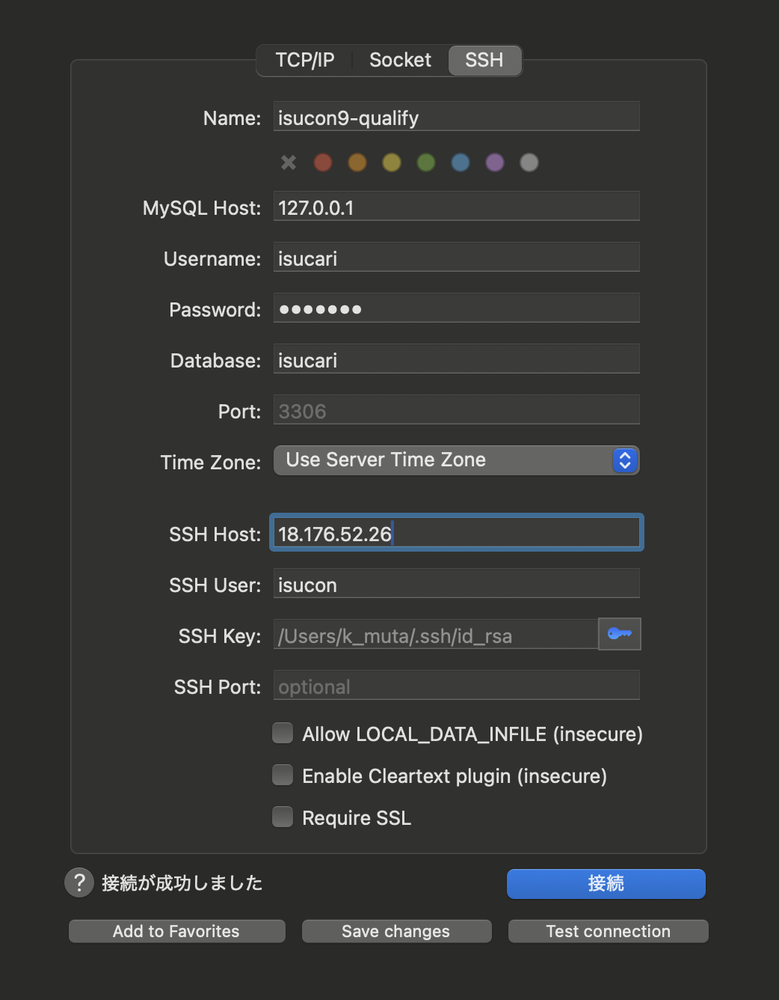

## 環境構築

AWS 環境を使うことが前提。

### 本戦 (WIP)

配布された CloudFormation から EC2 立てるだけ？
そこに、各種ツールを流し込めるようにすれば OK?

### 過去問

[aws-isucon](https://github.com/matsuu/aws-isucon) を参考に、過去問環境の構築ができる

#### AMI から EC2 インスタンスのセットアップ

1. [AMI](https://github.com/matsuu/aws-isucon?tab=readme-ov-file#ami) から試したい過去問のものを選択
2. AWS コンソールから「AMI からインスタンスを起動」を選択
3. インスタンスの各種設定して起動

- インスタンスタイプ: c5.large を選択 (理由: 基本本番では c5.large でインスタンス配布されることが多いため)
- キーペア: 適切な名前をつけて pem ファイルを作成、ローカルにダウンロード
- セキュリティグループ: HTTP, HTTPS, ssh を許可するように設定 (インバウンドルール)

#### ローカルから isucon ユーザー として ssh で繋ぐ

基本的に本戦・過去問では、isucon ユーザーがアプリケーションのファイルの書き込み権限を持っている。

そのため、ローカルから ssh 経由で isucon ユーザーとしてサーバーに入れると手間が省けて楽 (毎回 ubuntu ユーザーで入って、isucon ユーザーに切り替えするのは面倒)

```bash
# インスタンスを作った人が、ローカルにダウンロードしたキーペアを使ってsshで繋ぐ
ssh -i {ダウンロードしたpemファイルのパス} ubuntu@{サーバの公開IP}

# 以下のエラーで怒られたら、ファイル権限を修正する (ownerだけread/writeをできる設定に)
# ===================================
# Permissions 0644 for '/Users/k_muta/Downloads/mentos_pem_20241128.pem' are too open.
# It is required that your private key files are NOT accessible by others.
# This private key will be ignored.
# Load key "/Users/k_muta/Downloads/mentos_pem_20241128.pem": bad permissions
# ubuntu@18.176.52.26: Permission denied (publickey).
# ===================================
chmod 600 {ダウンロードしたpemファイルのパス}

# isuconユーザーに切り替え
sudo su - isucon

# ローカルの公開鍵 (ex. id_rsa.pub) をサーバーの .ssh/authorized_keysに記入
mkdir .ssh

# ローカルでssh keyを作成したことがない場合、ローカルにて `ssh-keygen` を実行し、公開鍵・秘密鍵を生成
# ローカルの公開鍵 (デフォルト: `~/.ssh/id_rsa.pub`) の中身をコピペする
vim .ssh/authorized_keys
```

セットアップ後、ローカルから `ssh isucon@{サーバの公開IP}` を実行すると、isucon ユーザーでサーバに入れるはず

参考

- https://github.com/sonots/isucon3_cheatsheet/blob/master/01.ssh.md#1-etcsshssh_config-%E3%81%AE%E8%A8%AD%E5%AE%9A%E7%A2%BA%E8%AA%8D
- https://github.com/sonots/isucon3_cheatsheet/blob/master/01.ssh.md#2-ssh-keygen-if-you-do-not-have-a-key

#### ssh config の設定

インスタンスが立ち上がった後に、全員が同じ設定をできるようにしたい

```bash
# ローカルにて `.ssh/config` を編集/作成
vim .ssh/config

# 以下を追加
# 1人1インスタンスの想定なので、誰がどこのHostに繋ぐかは共有する必要あり
# - Host: isucon (わかりやすくて短ければなんでも)
#   - User: isucon (本戦でアプリのオーナーがisuconでない場合は変更が必要)
#   - Hostname: EC2のインスタンスの公開IP (本戦で必ず変更が必要)
#   - IdentityFile: ~/.ssh/id_rsa (ローカルPCの秘密鍵のパスが異なる場合は変更が必要)
#   - ForwardAgent: yes (リモートでgitを使うために、ローカルのssh-agentに秘密鍵の情報を登録し、sshコマンド実行時にリモートに引き継ぎたいのでForwardAgentはyesにする必要がある)
Host isucon
  User isucon
  Hostname 18.183.170.20
  IdentityFile ~/.ssh/id_rsa
  ForwardAgent yes

# isuconユーザーで入れればOK
ssh isucon
```

#### EC2 に置かれているソースを git で ssh 経由で管理する

ローカルにある手元の秘密鍵で ssh 経由で git を扱いたい時
基本は以下リンクの通りやれば OK. (ssh config 使ってるので、その通りやるには各自設定が必要)

1. (やっていない人は) GitHub にローカル PC の公開鍵を登録
2. ssh-agent に秘密鍵を登録し、EC2 に ssh する (理由: リモートサーバでローカルの秘密鍵を直に置くのはやりたくないので、[ssh-agent 転送](https://qiita.com/hirotaka-tajiri/items/5197c8fa7f32d766c9cc)の仕組みを使って、ローカルの ssh-agent に秘密鍵を登録し、リモートに引き継ぐ形で実現する)

```bash

# ssh-agentに秘密鍵を登録。基本は `.ssh/id_rsa`
ssh-add {ローカルの秘密鍵のパス}

# 確認
ssh-add -l

# 上記に記述したssh configを設定している場合
ssh isucon

# ssh configを設定していない場合
# -A オプションで、ローカルのssh-agentの情報をリモートの接続先に引き継ぐ
# `.ssh/id_rsa` の場合は -i オプションは不要
ssh -A -i {ローカルの秘密鍵のパス} isucon@{インスタンスIP}
```

**-A をつけ忘れる！インスタンス IP を毎度つけたくない！という場合は各自で、.ssh/config に設定を書いてあげましょう**

参考 (ssh config を使う方法)

- https://github.com/sonots/isucon3_cheatsheet/blob/master/01.ssh.md#3-ssh-agent-%E3%82%92%E4%BD%BF%E3%81%A3%E3%81%A6%E3%83%AA%E3%83%A2%E3%83%BC%E3%83%88%E3%81%A7%E3%82%82%E8%87%AA%E5%88%86%E3%81%AE%E7%A7%98%E5%AF%86%E9%8D%B5%E3%81%A7-github-%E3%81%AB%E3%82%A2%E3%82%AF%E3%82%BB%E3%82%B9%E3%81%99%E3%82%8B

#### 個人の.gitconfig で仕込んでいる 設定を流し込む

ソースを git 管理する場合、ローカルで設定しているエイリアスを使いたくなるので、isucon ユーザーに切り替えて、ホームディレクトリ直下に.gitconfig を作成して流し込むのみ (scp するなりコピペするなりそこはよしなに)

```bash
ssh isucon@{サーバの公開IP}

# ローカルの `~/.gitconfig` の設定をコピペ
vim .gitconfig
```

#### ソースコードをリポジトリで管理する

1. リポジトリ作成
2. リモートサーバで必要なファイルを作ったリポジトリ向けに push

```bash
# 適切な階層で
git init
# 不要なファイルがあれば、.gitignoreに追加
# そのまま `git add .` をしちゃうと、サイズが大きいファイルのせいでgitが重くなることがある
vim .gitignore

git add .
git commit -m "Initial commit"
git branch -M main
git remote add origin {リモートリポジトリのURL}
git push -u origin main
```

#### 個人の DB クライアントから MySQL に繋ぐ

ローカルから DB に繋いで、データの中身やテーブル設計の確認、インデックスを GUI の DB クライアント経由で貼って SQL を確認したり、使い所は多い印象

ssh 経由で、ローカルの秘密鍵を使って繋ぐ

ex. Sequel Ace を使って ssh で DB に繋ぐ (.ssh/config を使わず、直で秘密鍵のパスを指定する方法)

DB のユーザー情報は、当日のアプリに設定されているものを指定


参考

- [Sequel Ace を使って ssh で DB に繋ぐ方法](https://hi3103.net/notes/web/1576)
- [DBeaver を使って ssh で DB に繋ぐ方法](https://yoshinorin.net/articles/2022/02/11/dbeaver-ssh-tunnering/)

#### サーバに入れたい計測ツールを流し込む (WIP)

以下を ansible で投入できるようにしたい

- pt-query-digest
- alp

ちなみに、[pprotein](https://github.com/kaz/pprotein) なる GUI で pt-query-digest, alp, pprof の結果を見れる OSS があるらしく、優勝チームはそれを利用しているよう

参考

- https://zenn.dev/team_soda/articles/20231206000000

#### Go のアプリ解析用に pprof 入れる (WIP)
