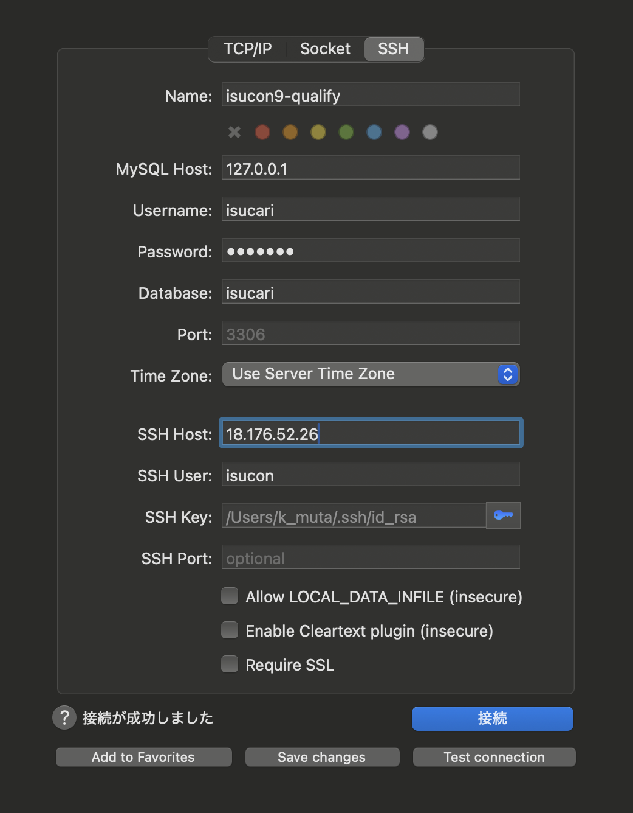

# isucon

## 流れ

- 環境構築
- 計測方法

## 環境構築

AWS 環境を使うことが前提。

### 本戦 (WIP)

配布された CloudFormation から EC2 立てるだけ？
そこに、各種ツールを流し込めるようにすれば OK?

### 過去問

[aws-isucon](https://github.com/matsuu/aws-isucon) を参考に、過去問環境の構築ができる

#### AMI から EC2 インスタンスのセットアップ

1. [AMI](https://github.com/matsuu/aws-isucon?tab=readme-ov-file#ami) から試したい過去問のものを選択
2. AWS コンソールから「AMI からインスタンスを起動」を選択
3. インスタンスの各種設定して起動

- インスタンスタイプ: c5.large を選択 (理由: 基本本番では c5.large でインスタンス配布されることが多いため)
- キーペア: 適切な名前をつけて pem ファイルを作成、ローカルにダウンロード
- セキュリティグループ: HTTP, HTTPS, ssh を許可するように設定 (インバウンドルール)

#### ローカルから isucon ユーザー として ssh で繋ぐ

基本的に本戦・過去問では、isucon ユーザーがアプリケーションのファイルの書き込み権限を持っている。

そのため、ローカルから ssh 経由で isucon ユーザーとしてサーバーに入れると手間が省けて楽 (毎回 ubuntu ユーザーで入って、isucon ユーザーに切り替えするのは面倒)

```bash
ssh -i {ダウンロードしたpemファイルのパス} ubuntu@{サーバの公開IP}

# 以下のエラーで怒られたら、ファイル権限を修正する (ownerだけread/writeをできる設定に)
# ===================================
# Permissions 0644 for '/Users/k_muta/Downloads/mentos_pem_20241128.pem' are too open.
# It is required that your private key files are NOT accessible by others.
# This private key will be ignored.
# Load key "/Users/k_muta/Downloads/mentos_pem_20241128.pem": bad permissions
# ubuntu@18.176.52.26: Permission denied (publickey).
# ===================================
chmod 600 {ダウンロードしたpemファイルのパス}

# isuconユーザーに切り替え
sudo su - isucon

# ローカルの公開鍵 (ex. id_rsa.pub) をサーバーの .ssh/authorized_keysに記入
mkdir .ssh

# ローカルでssh keyを作成したことがない場合、ローカルにて `ssh-keygen` を実行し、公開鍵・秘密鍵を生成
# ローカルの公開鍵 (デフォルト: `~/.ssh/id_rsa.pub`) の中身をコピペする
vim .ssh/authorized_keys
```

セットアップ後、ローカルから `ssh isucon@{サーバの公開IP}` を実行すると、isucon ユーザーでサーバに入れるはず

参考

- https://github.com/sonots/isucon3_cheatsheet/blob/master/01.ssh.md#1-etcsshssh_config-%E3%81%AE%E8%A8%AD%E5%AE%9A%E7%A2%BA%E8%AA%8D
- https://github.com/sonots/isucon3_cheatsheet/blob/master/01.ssh.md#2-ssh-keygen-if-you-do-not-have-a-key

#### EC2 に置かれているソースを git で ssh 経由で管理する

ローカルにある手元の秘密鍵で ssh 経由で git を扱いたい時
基本はこれ

- https://github.com/sonots/isucon3_cheatsheet/blob/master/01.ssh.md#3-ssh-agent-%E3%82%92%E4%BD%BF%E3%81%A3%E3%81%A6%E3%83%AA%E3%83%A2%E3%83%BC%E3%83%88%E3%81%A7%E3%82%82%E8%87%AA%E5%88%86%E3%81%AE%E7%A7%98%E5%AF%86%E9%8D%B5%E3%81%A7-github-%E3%81%AB%E3%82%A2%E3%82%AF%E3%82%BB%E3%82%B9%E3%81%99%E3%82%8B

#### 個人の.gitconfig で仕込んでいる 設定を流し込む

ソースを git 管理する場合、ローカルで設定しているエイリアスを使いたくなるので、isucon ユーザーに切り替えて、ホームディレクトリ直下に.gitconfig を作成して流し込むのみ (scp するなりコピペするなりそこはよしなに)

```bash
ssh isucon@{サーバの公開IP}

# ローカルの `~/.gitconfig` の設定をコピペ
vim .gitconfig
```

#### 個人の DB クライアントから MySQL に繋ぐ

ローカルから DB に繋いで、データの中身やテーブル設計の確認、インデックスを GUI の DB クライアント経由で貼って SQL を確認したり、使い所は多い印象

ssh 経由で、ローカルの秘密鍵を使って繋ぐ

ex. Sequel Ace を使って ssh で DB に繋ぐ (.ssh/config を使わず、直で秘密鍵のパスを指定する方法)

DB のユーザー情報は、当日のアプリに設定されているものを指定


参考

- [Sequel Ace を使って ssh で DB に繋ぐ方法](https://hi3103.net/notes/web/1576)
- [DBeaver を使って ssh で DB に繋ぐ方法](https://yoshinorin.net/articles/2022/02/11/dbeaver-ssh-tunnering/)

#### サーバに入れたい計測ツールを流し込む (WIP)

以下を ansible で投入できるようにしたい

- pt-query-digest
- alp

ちなみに、[pprotein](https://github.com/kaz/pprotein) なる GUI で pt-query-digest, alp, pprof の結果を見れる OSS があるらしく、優勝チームはそれを利用しているよう

参考

- https://zenn.dev/team_soda/articles/20231206000000

#### Go のアプリ解析用に pprof 入れる (WIP)

### 計測

本番のアプリが Nginx と MySQL を使っていることが前提

#### スロークエリ計測

pt-query-digest を使う

1. pt-query-digest のインストール

```bash
sudo apt install percona-toolkit
```

2. MySQL の設定でスロークエリを吐き出すようにする

```bash
sudo vim /etc/mysql/mysql.conf.d/mysqld.cnf

# 以下を追加
slow_query_log = 1
slow_query_log_file = /var/log/mysql/mysql-slow.log
long_query_time = 0

sudo service mysql restart
# or
sudo systemctl restart mysql

# 変更が読み込まれているかの確認
sudo mysql
mysql> show variables like 'slow%';
```

3. (2 回目以降の実行の場合) ログローテ

ログが一つのファイルに積み上がる形式のため、視認性のためにログローテする

```bash
now=`date +%Y%m%d-%H%M%S` && sudo mv /var/log/mysql/mysql-slow.log /var/log/mysql/mysql-slow.log.$now && sudo mysqladmin flush-logs
```

4. ベンチマーカー実行

方法なりは、過去問や本戦の README を参照

5. pt-query-digest を実行

```bash
# スロークエリログ解析
sudo pt-query-digest /var/log/mysql/mysql-slow.log

# ログの中身が大きい時は、lessでパイプする
sudo pt-query-digest /var/log/mysql/mysql-slow.log | less
```

補足: ADMIN PREPARE 対策 (WIP)

ADMIN PREPARE がボトルネックに上がってきた時は、`&interpolateParams=true` を追加。

参考

- [pt-query-digest で MySQL のスロークエリを集計する](https://atsum.in/linux/pt-query-digest/)
- [pt-query-digest の使い方 w/ ADMIN PREPARE の話](https://isucon-workshop.trap.show/text/chapter-3/1-SlowQueryLog.html)

#### Nginx のアクセスログ

alp を使う
秘伝のタレ云々ものちにまとめたい

1. alp をインストール

```bash
wget https://github.com/tkuchiki/alp/releases/download/v1.0.21/alp_linux_amd64.zip
unzip alp_linux_amd64.zip
sudo install ./alp /usr/local/bin
```

2. Nginx のログの出力設定変更

```
sudo vim /etc/nginx/nginx.conf

# httpブロックの中に、log_formatの設定追加
http {
  log_format ltsv "time:$time_local"
    "\thost:$remote_addr"
    "\tforwardedfor:$http_x_forwarded_for"
    "\treq:$request"
    "\tmethod:$request_method"
    "\turi:$request_uri"
    "\tstatus:$status"
    "\tsize:$body_bytes_sent"
    "\treferer:$http_referer"
    "\tua:$http_user_agent"
    "\treqtime:$request_time"
    "\truntime:$upstream_http_x_runtime"
    "\tapptime:$upstream_response_time"
    "\tcache:$upstream_http_x_cache"
    "\tvhost:$host";

  access_log  /var/log/nginx/access.log ltsv;
}

sudo service nginx restart
# or
sudo systemctl reload nginx
```

3. (2 回目以降) ログローテ & 再起動

```bash
echo -n "" > /var/log/nginx/access.log && sudo chmod 777 /var/log/nginx/access.log
# ログローテ & nginx再起動
sudo rm /var/log/nginx/access.log && sudo systemctl reload nginx
```

4. 実行 (WIP. alp コマンドについてもっと詳しく)

特定の正規表現でグルーピングして、結果を出力することができる

```bash
alp -f /var/log/nginx/access.log > result.txt
```

参考

- [alp の使い方](https://zenn.dev/tkuchiki/articles/how-to-use-alp)

### 便利コマンド類 (WIP)

よく使うコマンドは、Makefile で完結するように

- top/htop
- systemctl
- journalctl
